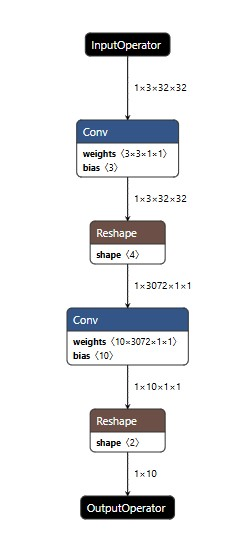

# Custom pytorch model

## Introduction

The Rockchip platform provides the capability to run neural network inference on an optimized processor. The examples in the rknn-toolkit2 repository demonstrate how to convert well-known architectures into the RKNN format, such as ResNet and YOLO.  

However, there is often a need to run a custom neural network architecture, which can present certain challenges. The code in the `test.py` file shows how to convert a simple image classification architecture into RKNN using PyTorch and ONNX as an example.  

Analyzing the conversion process helps to better understand how the platform works, which is also useful for educational purposes. It is easy to add an arbitrary PyTorch layer to this example and see how it is converted into instructions for the Rockchip NPU.  

## Pipeline description 

### 1. Define and build pytorch model

The *OneLayerModel* is a very simple neural network built on PyTorch. It is designed for classifying small images and demonstrates the basic pipeline for converting models from PyTorch to ONNX and then to RKNN.

The architecture consists of two main layers:

- The **Flatten** layer transforms the input tensor of dimension *(1, 3, 32, 32)* (representing 1 image with 3 channels and a resolution of 32x32 pixels) into a one-dimensional vector of length 3072.

- The **Linear** layer is a fully connected layer that takes this vector and converts it into an output of 10 classes.

The weights of the PyTorch model can be visualized in Netron  


#### Note!!  

It is important to note that all models in the *rknn-toolkit2* repository use the **NCHW** format (channel first). According to the documentation, the *input_size_list* parameter in the *rknn.load_onnx* method controls the input data dimensions. However, setting *input_size_list=[[1, 32, 32, 3]]* does not allow using the NHWC format. Unfortunately, no parameter was found that would allow setting the **NHWC** format (channel last) when building the model.

Attempting to use the model in **NHWC** format results in an error during the model building stage:
```
ValueError: The channel of r_shape [1, 32, 32, 3] must be 3!
```

### 2. Convert pytorch model to onnx

The `build_pytorch_model` function creates an instance of the `OneLayerModel` and saves its weights in a `.pt` file. This function is responsible for the initial creation and saving weights of the model in its native PyTorch format.

The `build_onnx_model` function performs a more complex task. It creates a model instance, loads the previously saved weights from the `.pt` file, switches the model to evaluation mode (`eval`), and then exports it to the ONNX format using `torch.onnx.export`. The result is saved in an `.onnx` file.

Together, these functions create a sequential conversion pipeline: first saving the model in PyTorch format, then converting it to ONNX. This two-step process is necessary for further deployment on the Rockchip platform.
Here is the Netron representation of `.onnx` model:  


In the ONNX format, the model uses the **Gemm** operation, which represents basic matrix multiplication. This is a fundamental operation for neural network computations.  

#### Note!!  

It is important to note a technical detail: when exporting to ONNX, the `dynamo=True` parameter must be specified. Without it, an error occurs:
```
ValueError: Export destination must be specified for torchscript-onnx export.
```

This limitation is related to the specifics of the ONNX library and must be taken into account during the conversion process.

### 3. Convert onnx to rknn

The next step in the conversion process involves creating an **RKNN object**, which serves as the main controller for managing the model conversion and inference processes on the Rockchip platform.

During this stage, several important configuration steps take place:
* **Parameter setup** for the target model, including specifying the platform (in this case, 'rk3588')
* **Model loading** — the ONNX model is imported into the RKNN object for further processing
* **Preparation phase** for converting the model into the RKNN format and subsequent execution on the Rockchip NPU

This stage is crucial as it lays the foundation for the entire conversion process. By configuring the correct parameters and loading the ONNX model, the system prepares all necessary components for transforming the model into a format optimized for execution on Rockchip hardware.

The RKNN object acts as an intermediary between the high-level model representation in ONNX format and the low-level optimized version that can efficiently utilize the capabilities of the Rockchip NPU.

### 4. Build and export rknn model  

At this stage, the ONNX model is converted into the internal RKNN format, the graph is optimized, and preparations are made for running it on the Rockchip NPU.

If **quantization** is enabled (`do_quantization=True`), the model weights and input data are converted to integer format to speed up inference. This conversion is crucial for efficient processing on the NPU.

The **dataset.txt** file contains a list of paths to images or numpy arrays used to collect statistics during quantization. These data help correctly select parameters for the float to int8 conversion, minimizing accuracy loss when running the model on the NPU. If quantization is not used, this file can be omitted.

The intermediate representations of the ONNX model show the following stages:

* **Basic optimization**: no changes were made to the original structure 


* **Operation adjustment**: additional dimension was added to the Gemm operation


* **Operation fusion**: several operations were combined into more efficient blocks


These transformations ensure that the model is optimized for efficient execution on the target hardware while maintaining accuracy. The entire process results in a highly optimized model ready for deployment on the Rockchip platform.

The export stage marks the final step in converting a neural network into a format optimized for Rockchip devices. During this process, the following key actions take place:

The system creates an **.rknn file** that contains both the model architecture and its weights. This file format is specifically designed for efficient execution on Rockchip hardware.

The model undergoes final **platform-specific optimization** tailored for the target device (in this case, RK3588). All adjustments made during previous stages are consolidated, and the model is prepared for deployment.

The resulting file is saved according to the path specified in the **RKNN_MODEL** variable. This finalized model is now ready for deployment and inference on the target hardware.

It's important to note that the exported model:
* Contains all necessary optimizations
* Is fully prepared for execution on NPU
* Includes both structure and pre-optimized weights
* Is specifically tuned for the chosen platform architecture

After successful export, the model reaches its final form, ready to be deployed and used for inference tasks on Rockchip devices. This stage completes the entire conversion pipeline from PyTorch through ONNX to the final RKNN format optimized for hardware acceleration. 

Final `.rknn` model representation: 



### 5. Init runtime and inference

During the **runtime preparation** phase, all necessary components are configured for subsequent model deployment on the target device. This stage involves loading the optimized RKNN model into device memory and configuring all system resources required for neural network operation.

The system performs several critical checks:
* Verifies the availability of required libraries
* Allocates necessary memory resources
* Configures execution parameters

It's important to note that since our example runs on an **x86 platform**, a RockChip platform simulator is utilized for testing purposes. Successful initialization confirms that the system is ready for inference execution.

Once initialization is complete, the **inference phase** begins, where the model processes input data and produces output results. During this stage, input data is fed into the prepared model in the following format:
* Data is provided as a numpy array
* Uses NCHW data format (batch, channels, height, width)

The inference process involves several key steps:
* The model receives prepared input data
* Data is processed sequentially through all neural network layers
* Necessary computations are performed on the NPU accelerator
* Output results are generated and stored in the *outputs* variable

After inference completion, the model remains ready to process additional input data until the *rknn.release()* method is called, which finalizes the model's operation. This ensures efficient and continuous processing capabilities for real-time applications. 

## Output analysis

In the logs, you can observe an interesting table displaying the contents of the RKNN computational graph along with the processor (CPU/NPU) assigned to each node. This table provides detailed insights into how the model operations are distributed across different hardware components.

```
D RKNN: [20:41:40.895] --------------------------------------------------------------------------------------------------------------------------------------------------------------------------
D RKNN: [20:41:40.895]                                                         Network Layer Information Table                                                      
D RKNN: [20:41:40.895] --------------------------------------------------------------------------------------------------------------------------------------------------------------------------
D RKNN: [20:41:40.895] ID   OpType             DataType Target InputShape                               OutputShape            Cycles(DDR/NPU/Total)    RW(KB)       FullName        
D RKNN: [20:41:40.895] --------------------------------------------------------------------------------------------------------------------------------------------------------------------------
D RKNN: [20:41:40.895] 0    InputOperator      INT8     CPU    \                                        (1,3,32,32)            0/0/0                    0            InputOperator:l_x_
D RKNN: [20:41:40.895] 1    Conv               INT8     NPU    (1,3,32,32),(3,3,1,1),(3)                (1,3,32,32)            831/4096/4096            3                            
D RKNN: [20:41:40.895] 2    Reshape            INT8     NPU    (1,3,32,32),(4)                          (1,3072,1,1)           0/0/0                    16           Reshape:flatten_1_tp_rs
D RKNN: [20:41:40.895] 3    Conv               INT8     NPU    (1,3072,1,1),(10,3072,1,1),(10)          (1,10,1,1)             1441/1536/1536           33           Conv:Gemm_1#2   
D RKNN: [20:41:40.895] 4    Reshape            INT8     CPU    (1,10,1,1),(2)                           (1,10)                 0/0/0                    0            Reshape:layer_1_mm_tp_rs
D RKNN: [20:41:40.895] 5    OutputOperator     INT8     CPU    (1,10)                                   \                      0/0/0                    0            OutputOperator:layer_1
D RKNN: [20:41:40.895] --------------------------------------------------------------------------------------------------------------------------------------------------------------------------
```

The table includes the following key information for each layer:

* **Layer ID** — unique identifier for each operation
* **Operation Type** (OpType) — specifies the type of operation being performed (e.g., Conv, Reshape)
* **Data Type** — indicates the format used (in this case, INT8)
* **Target Processor** — shows whether the operation runs on CPU or NPU
* **Input/Output Shapes** — dimensions of data tensors
* **Performance Metrics** — includes cycle counts and memory usage statistics

From the table, we can see the following distribution:
* **Input data** is handled by the CPU
* **Convolution operations** are offloaded to the NPU for processing
* **Reshape operations** are distributed between NPU and CPU
* **Output data** is processed on the CPU

Key observations from the table:
* Computationally intensive operations are efficiently delegated to the NPU accelerator
* Data transformation operations are managed by the CPU
* All processing is performed in INT8 format for optimized performance

The table serves as a valuable tool for understanding how the model is executed and helps in fine-tuning the deployment for optimal performance.

In the console, you can find detailed information about the model conversion process. The majority of the logs consist of messages related to the model building progress.

You can delve into the main optimization stages, such as **fuse ops**. Here is an example of the optimization process:

```
D     convert_gemm_by_exmatmul: remove node = ['Gemm_1'], add node = ['flatten_1_tp', 'flatten_1_tp_rs', 'Gemm_1#1', 'layer_1_mm_tp', 'layer_1_mm_tp_rs']
D     unsqueeze_to_4d_transpose: remove node = [], add node = ['flatten_1_rs', 'flatten_1_tp-rs']
D     fuse_two_reshape: remove node = ['Reshape_3']
D     fuse_transpose_reshape: remove node = ['flatten_1_tp', 'layer_1_mm_tp']
D     fuse_two_reshape: remove node = ['flatten_1_rs']
D     fuse_two_reshape: remove node = ['flatten_1_tp-rs']
D     convert_exmatmul_to_conv: remove node = ['Gemm_1#1'], add node = ['Gemm_1#2']
```

These logs show the following optimization steps:

1. **convert_gemm_by_exmatmul** — converts and restructures the Gemm operation by removing and adding new nodes
2. **unsqueeze_to_4d_transpose** — performs dimension expansion and transposition operations
3. **fuse_two_reshape** — merges multiple reshape operations into one
4. **fuse_transpose_reshape** — combines transpose and reshape operations
5. **convert_exmatmul_to_conv** — transforms matrix multiplication operations into convolution operations

These logs provide valuable insights into how the model is optimized during the conversion process, showing exactly which nodes are being removed or added and how the operations are being restructured for better performance on the target hardware. 

During the model conversion process, the system issues important warnings regarding data type changes:

The following warnings appear in the console:

```
W build: The default input dtype of 'l_x_' is changed from 'float32' to 'int8' in rknn model for performance!
                       Please take care of this change when deploy rknn model with Runtime API!
W build: The default output dtype of 'layer_1' is changed from 'float32' to 'int8' in rknn model for performance!
                      Please take care of this change when deploy rknn model with Runtime API!
```

These warnings indicate two critical changes:
* The **input data type** ('l_x_') has been changed from float32 to int8
* The **output data type** ('layer_1') has been changed from float32 to int8

These changes are made for performance optimization purposes. It's crucial to consider these modifications during the deployment phase when working with the Runtime API.

Important notes:
* Developers must account for these data type changes when preparing input data
* Output processing logic should be adjusted to handle int8 data
* Proper handling of data types is essential for correct model inference results

This conversion from float32 to int8 is part of the quantization process that helps improve inference speed and reduce memory usage on the target hardware.


## Conclusion 

The Rockchip platform is a powerful tool for working with neural networks. It enables running models on a specialized processor that significantly accelerates data processing. What's particularly valuable is that developers can not only use pre-built architectures but also create their own models.

The process of converting a model from PyTorch to RKNN format is quite transparent. First, the model is saved in the intermediate ONNX format, and then converted into a format understandable by the Rockchip processor. During this process, several optimizations take place, the main one being the conversion of data from floating-point to integer format, which makes computations faster.

By default, the platform works with the NCHW data format (where image channels come first). This limitation must be considered when preparing data for the model. It also became clear that for successful operation, it is necessary to properly configure all conversion stages — from model creation to its launch.

In summary, the tutorial demonstrates that working with the Rockchip platform is not just about using model_zoo solutions but also provides an opportunity to deeply understand the model conversion process and create effective solutions for unique tasks. This opens up great prospects for developers who want to optimize their neural network operations. 
